# ElevatorCodingChallenge
<h1>Concept</h1>
This challenge is code up a service that is responsible for handling a fictional building&#39;s Elevator
operations.
User of the service should be able to summon an elevator for a particular building they are in. And then interact with that elevator
through API requests. Once in the elevator, they should be able to select a floor for the elevator
to take them to. 

<ul>
 <li>The application should be a REST API </li>
 <li>NodeJS is used for backend here.</li>
 <li>The application should be designed to run in the cloud or in a container, AWS Lambda functions are used with API Gateway here.</li>
 <li>The application data must be persisted in a database of some type. In this instance DynamoDB is used.</li>
</ul>

<h1>Architecture</h1>

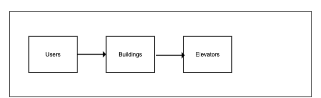

<h1> Structure </h1>

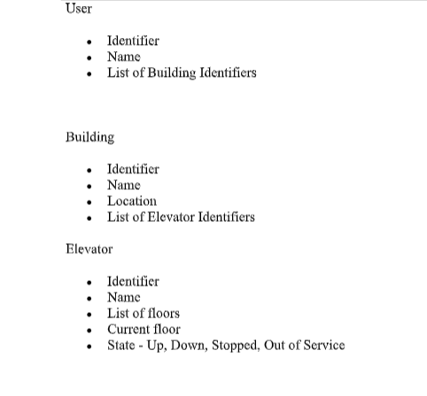

<h1>Prerequisites</h1>
<ul>
<li>You will need Nodejs and npm installed if running this application on windows.</li>
<li>The other packages should be included with this project when cloned but just incase I will include more info. </li>
<li>The first thing I did was install serverless framework with <i>npm install serverless</i></li>
<li>I also had to install express with <i>npm install express</i></li>
<li>Also needed <i>npm install serverless-http</i> and <i>npm install express</i></li>
<li>You will need to also configure your aws account with serverless, you can setup your keys on aws/*yourname*/mysecurity credentials.</li>
<li>The command then is <i>serverless config credentials --provider aws --key *YOURKEYHERE* --secret *YOURSECRETKEYHERE*</i></li>
<li>You must then deploy serverless by using the command <i>sls deploy</i></li>
<li>When you are finished using the service you can remove everything by using <i>sls remove</i></li>
<li>Additional Documentation for Serverless setup can be found <a href="https://www.serverless.com/blog/how-create-rest-api-serverless-components">here</a></li>
</ul>

<h1> Serverless Framework , AWS Lambda Functions & API Gateway</h1>
<b>So why Serverless framework??:</b>
<ul>
<li>When we say an application is serverless, it is not exactly serverless! The point to take on-board here is that we do not have to worry about the provisioning a server or any of the complexity that comes with managing a server as our cloud provider handles this. </li>
<b>So why AWS Lambda??:</b>
<li>The main thing with AWS Lambda functions is that you can set up a different type of 'trigger' to invoke whichever function. I use HTTP trigger here as
it's a REST API I am developing</li>
<b>Where does API Gateway come in?</b>
<li>API Gateway is then in turn sent http requests from a url generated by AWS (in this case using Postman) and API Gateway then has to be told(configured) to know which functions to invoke </li>
</ul>

<h1> Nodejs</h1>
So why did I use NodeJS? After some research I chose NodeJS to develop this application for the following reasons:
<ul>
<li>I had some previous experience with Javascript so I was up to the challenge of using NodeJS</li>
<li>Quick & easy development - You can construct REST API with Node.js really quickly.</li>
<li>By using NodeJS, I could then use 'middleware' or extensions like ExpressJS (for writing handlers for requests with different HTTP verbs at different URL paths) and body-parser, which helps us decode the body from a HTTP request</li>
</ul>

<h1> DynamoDB </h1>
Why I chose DyanmoDB?
<ul>
<li>Scalable – User can store unlimited amount of data.</li>
<li>Secure – DynamoDB uses proven secured methods to authenticate users and prevent unauthorized data access</li>
<li>Cost Effective – One year free tier allows more than 40 million database operations/month and pricing is based on throughput (read/write per second) rather than storage</li>
</ul>

Here are how the tables generated in this project appear in DynamoDB.
Note the id's are relevent to each other between tables.

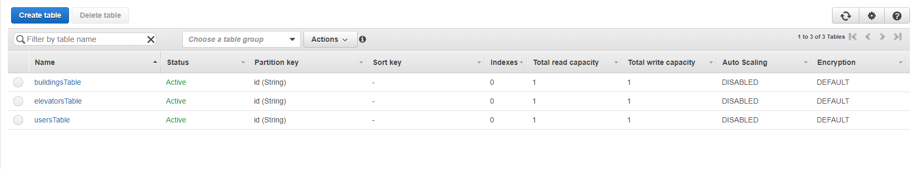

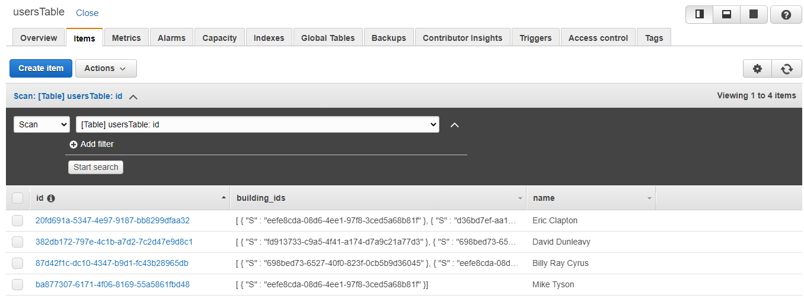

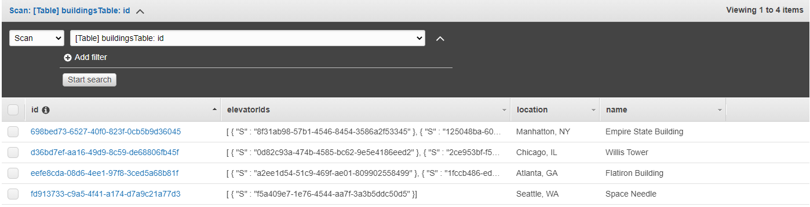

<h1> REST Requests </h1>

<h2>Add a user</h2>
<b>Postman</b>

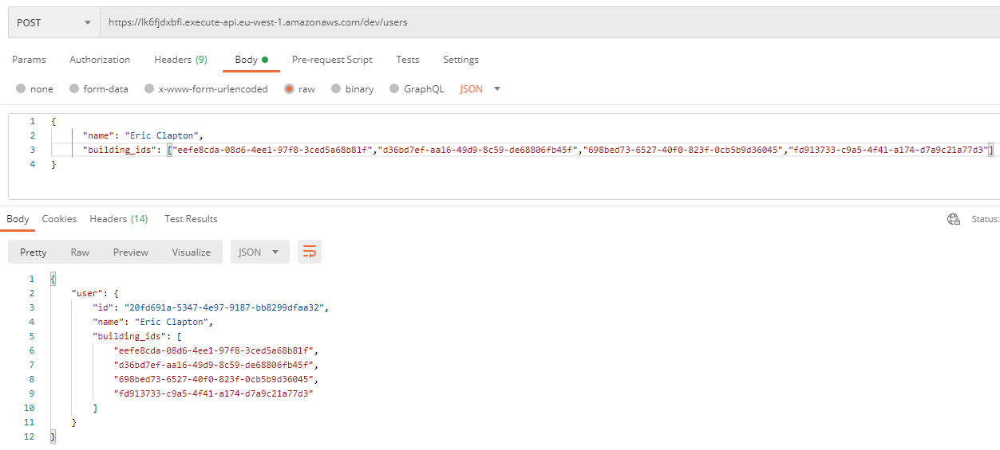

<b>Code</b>

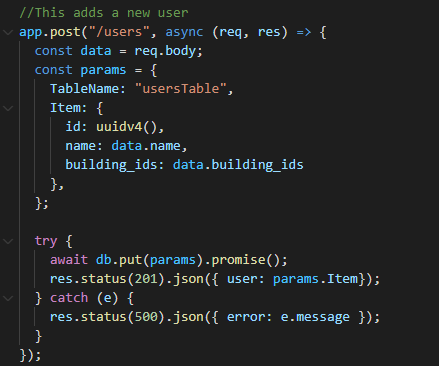

<h2>Update a user - change name, modify buildings belongs to </h2>
<b>Before</b>

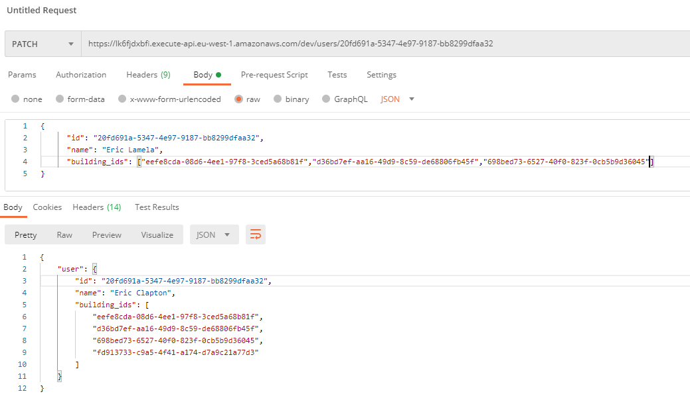

<b>After</b>

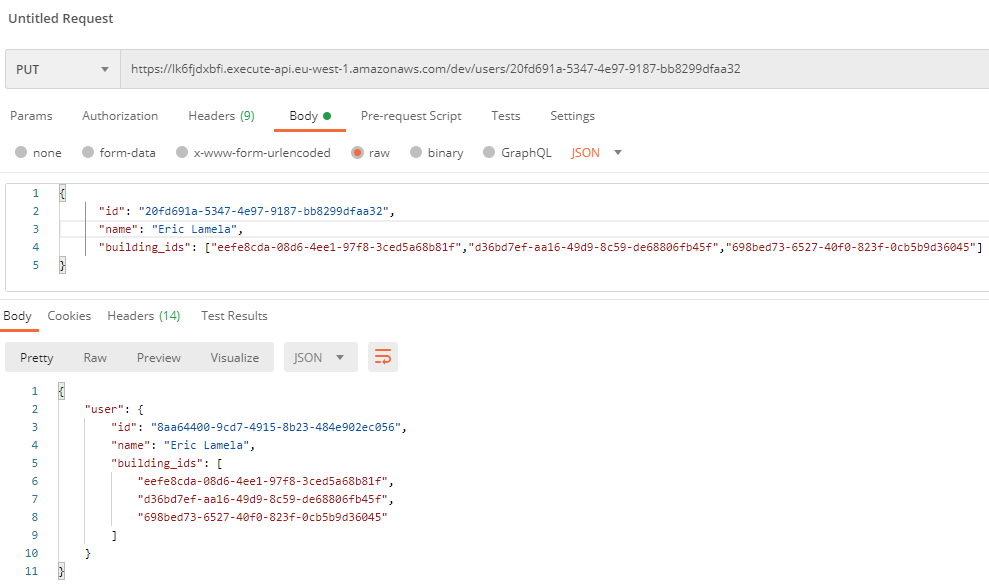

<b>Code</b>

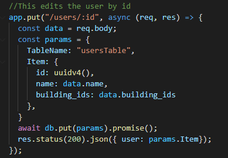

<h2>Find a building for a user</h2>
<b>User has building id</b>

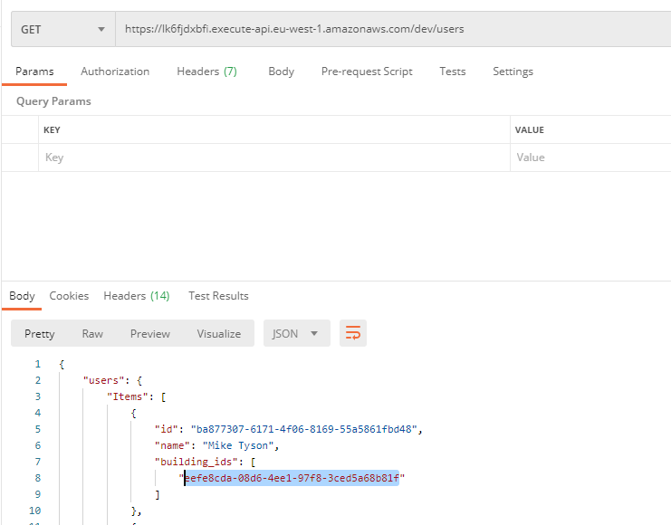

<b>User searches for building</b>

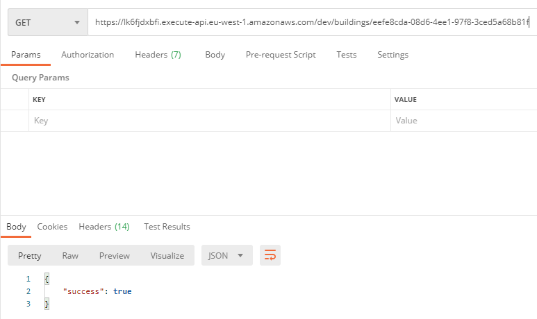

<b>To see all buildings</b>

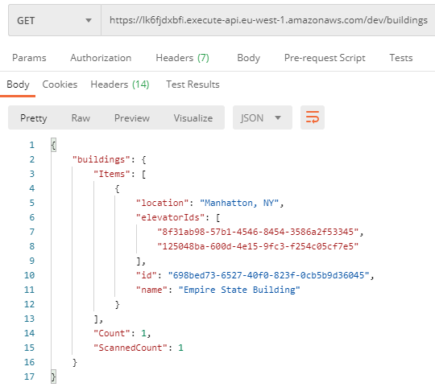

<b>Code</b>

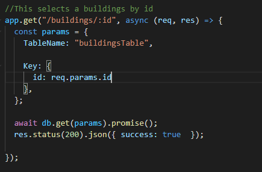

<h2>Get status of all elevators in a building for a user </h2>

<b>First find elevator ids in the building</b>

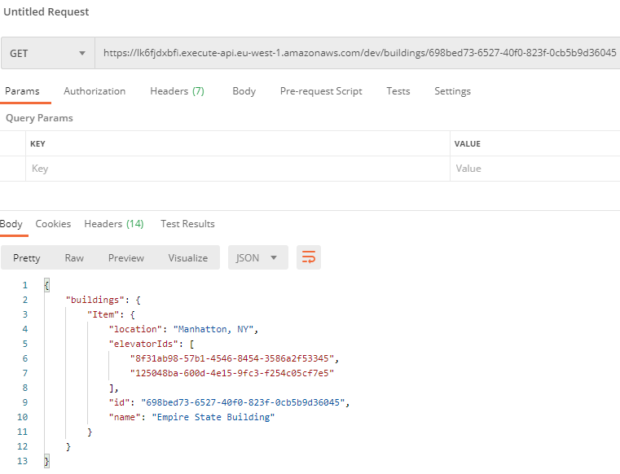

<b>Then check status of elevator by id</b>

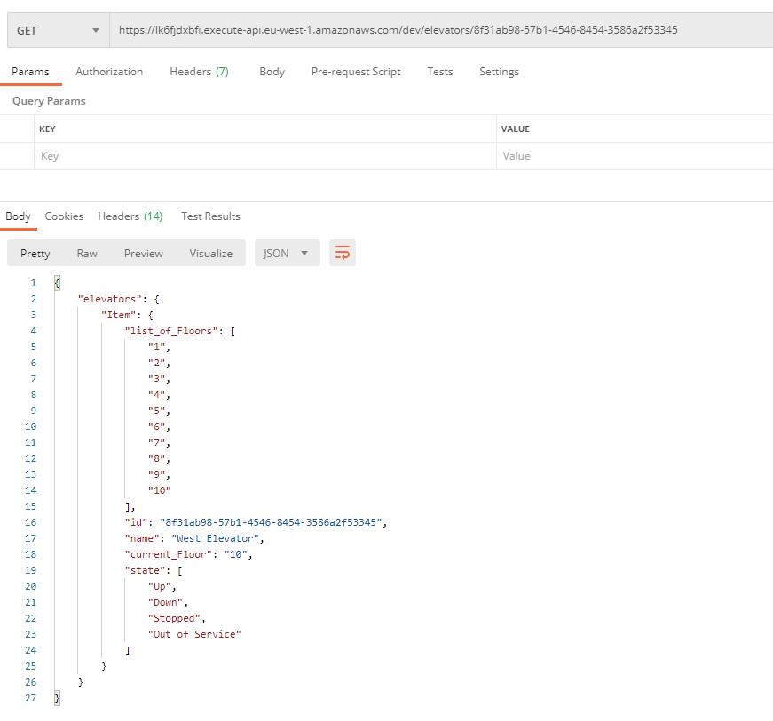

<b>Code</b>

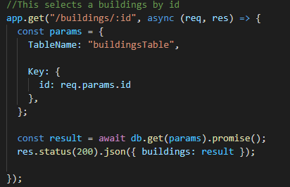

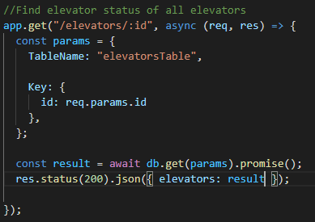

<h2>User summons an elevator </h2>

<b>Finds elevator by id contained in buildingsTable</b>

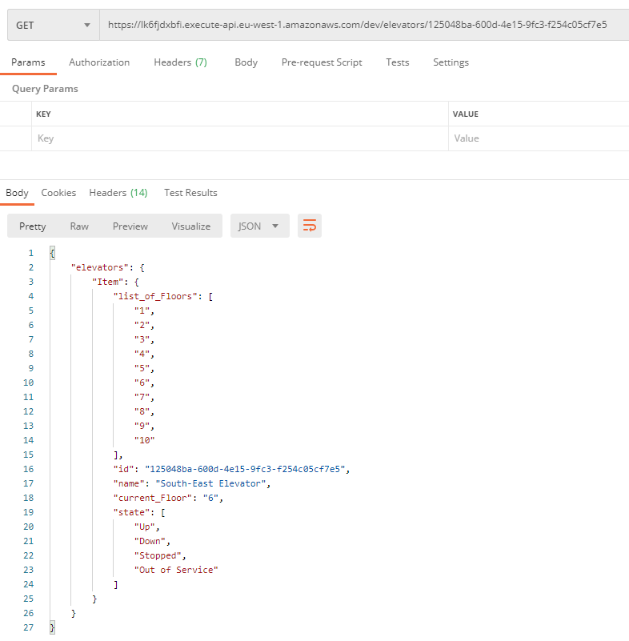

<b>Code</b>

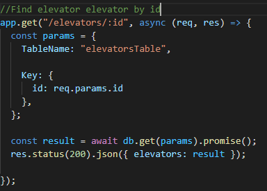

<h2>User selects a floor </h2>

<b>PUT updates floor</b>

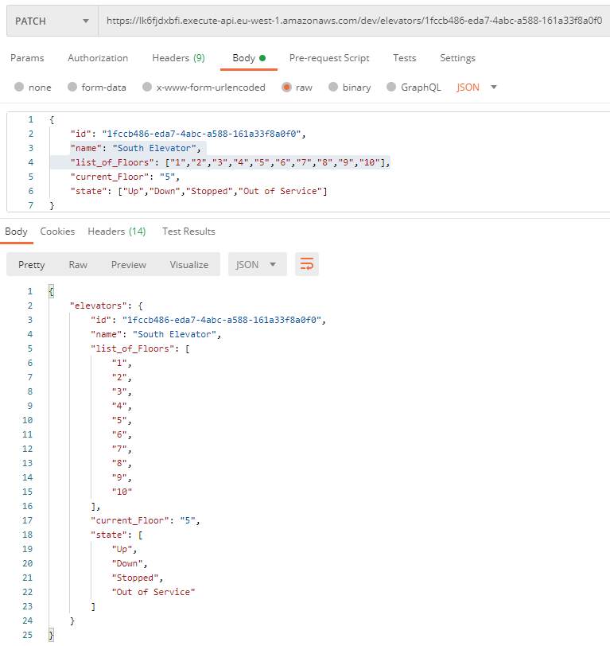

<b>Code</b>

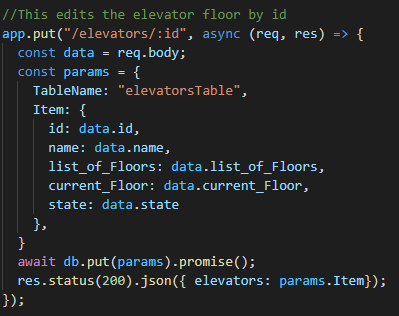

<h1> Testing </h1>
Primarily Postman was the software used for testing my functions. However when it came to debugging, I utlized features found
within AWS Lambda Cloudwatch, this made logs from calls available to me, helping me learn why certain calls failed. Very useful.

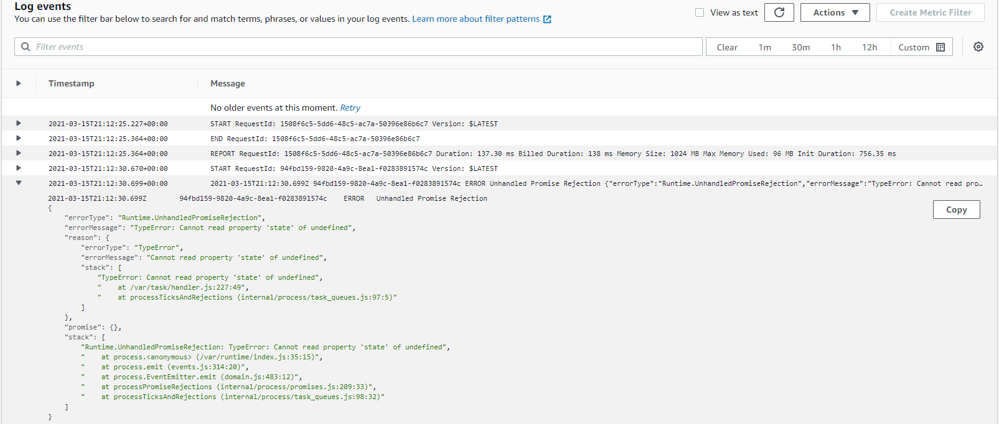

<h1>Learning outcome</h1>
Prior to this project, I had not been exposed to any technology available in AWS. This project introduced me to the likes
of DynamoDB, AWS Lambda and API Gateway and I feel I have learnt alot from taking the approach I have taken. I also gots some experience with 
Serverless framework and Express also as a bonus. 

<h1>More information</h1>
<h2>Contact Me</h2>
david.dunleavy93@gmail.com